# Advanced Programming Module 10 - Broadcast Chat
### Darren Marcello Sidabutar - 2306256293

> How it runs

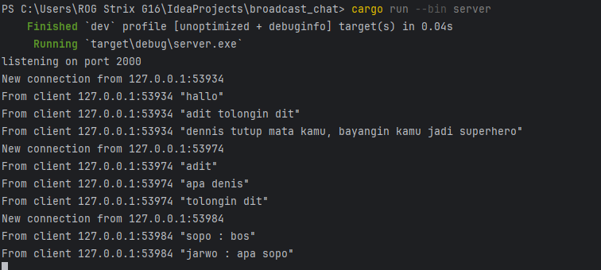
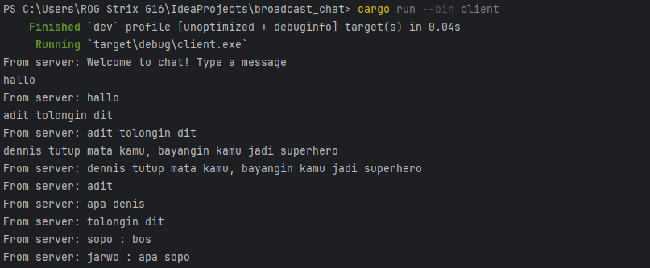
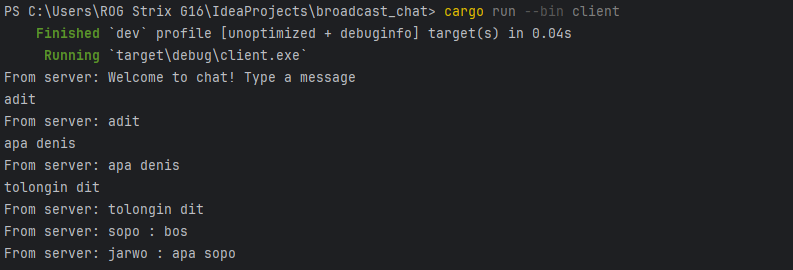
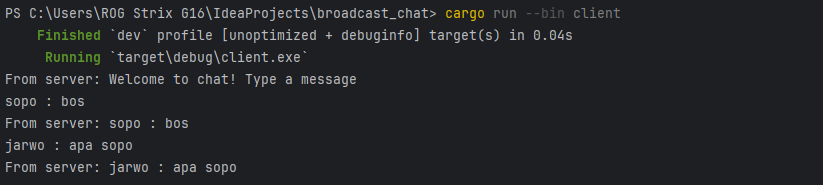

Whenever a client sends a message, it first reaches the server. The server then forwards that message to every connected client, including the one who sent it. This is made possible by the server maintaining a list of current connections and actively listening for new messages to relay.

> Modifying port

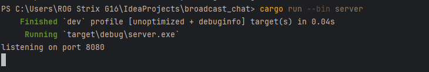
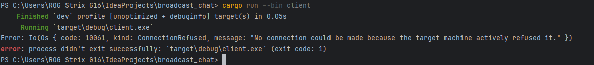
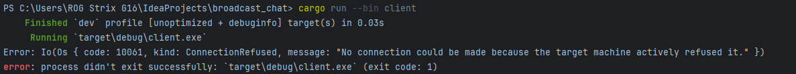
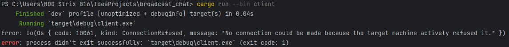

In this case, the client and server are using different ports—the server listens on port 8080, while the client tries to connect to port 2000. Since there's no WebSocket server on port 2000, the client repeatedly fails to connect and throws a ConnectionRefused error.
To resolve this, the client's code should be updated to match the server's port by changing the line to:
ClientBuilder::from_uri(Uri::from_static("ws://127.0.0.1:8080")).
Both sides use the ws:// scheme, indicating that the communication is happening over WebSocket.

> Small changes

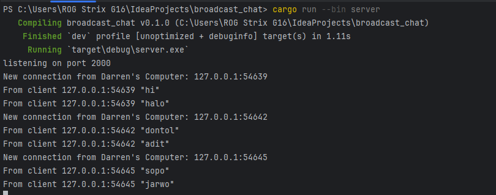
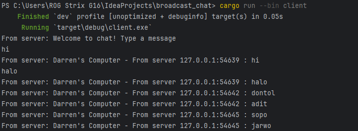
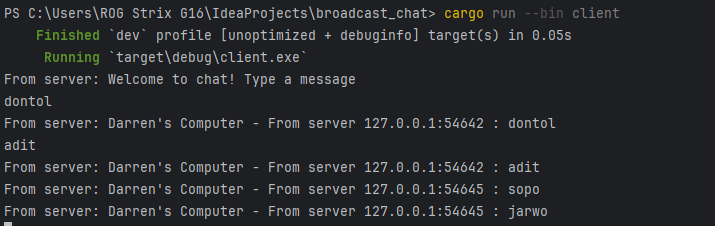
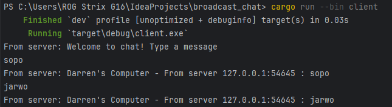

In my version, I formatted the messages on both the server and client to include the sender’s IP address and port in the format ({addr} : {text}), and added custom prefixes like “From server” and “Thata’s Computer.” This allows each message to clearly show its origin, making it easier to identify which client sent it.